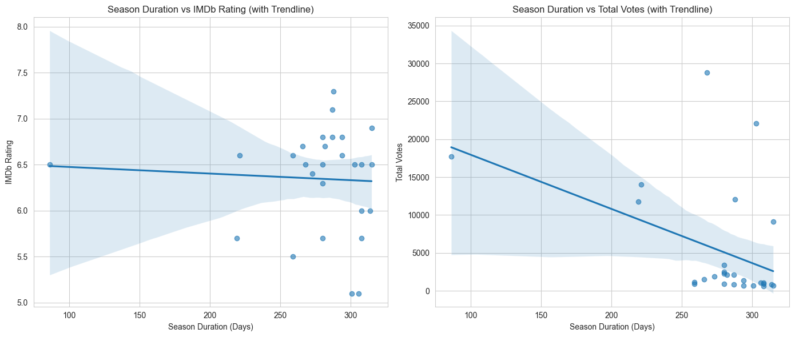

## Question 1: What Factors Influence a Season's Popularity and How Does Season Duration Impact Audience Reception?

### Introduction

The Power Rangers franchise has not only entertained audiences for decades but has also evolved in its storytelling and production style. In this analysis, we aim to delve deeper into what determines a season’s popularity beyond simple IMDb ratings. Specifically, we examine whether certain factors—such as the number of episodes, the role of different producers, and the overall duration of a season—have a measurable impact on audience reception. By understanding these relationships, we can gain insights into how production choices may affect viewer engagement over the long run.

To tackle this question, we use the `power_rangers_seasons.csv` dataset, which contains season-level information including:
- `season_title`, `season_num`
- `number_of_episodes`
- `air_date_first_ep` and `air_date_last_ep`
- `producer`
- `IMDB_rating`

These variables provide a structured view of each season, allowing us to analyze the correlation between season length/duration and its overall rating.

---

### Approach

Our strategy involves several key steps:

1. **Data Processing:**  
   - Convert date columns (e.g., `air_date_first_ep` and `air_date_last_ep`) into datetime objects.
   - Calculate the season duration (in days) as the difference between the first and last air dates.
   - Categorize seasons based on duration, if necessary (e.g., short, medium, long).

2. **Visualization Techniques:**  
   To answer our question effectively, we use a combination of visualizations:
   - **Bar Charts:** To compare the average IMDb ratings across different producers. This chart helps in revealing which producers consistently have better-received seasons.
   - **Scatter Plots with Regression Lines:** To explore the correlation between the number of episodes (or season duration) and IMDb ratings, highlighting whether longer seasons tend to score higher or lower.
   - **Boxplots:** To display the distribution of ratings across various season duration categories. Boxplots are instrumental in detecting outliers and understanding variability.
   - **Time Series Plots:** To observe how ratings have trended over time, thus providing context on changing audience preferences and production quality over the years.

3. **Data Aggregation:**  
   We aggregate key variables (e.g., mean ratings per producer, total votes, and season duration) to examine trends and potential correlations between these factors and audience reception.

---

### Analysis

Below are code examples that illustrate our analysis.

**Code Block 1: Analyzing Key Popularity Factors**

```python
import pandas as pd
import matplotlib.pyplot as plt
import seaborn as sns
import matplotlib.dates as mdates

# Assume seasons_df is the DataFrame loaded from power_rangers_seasons.csv
# Preprocess dates and compute season duration in days
seasons_df['air_date_first_ep'] = pd.to_datetime(seasons_df['air_date_first_ep'])
seasons_df['air_date_last_ep'] = pd.to_datetime(seasons_df['air_date_last_ep'])
seasons_df['season_duration'] = (seasons_df['air_date_last_ep'] - seasons_df['air_date_first_ep']).dt.days

# Set up the visualization style
sns.set(style="whitegrid")
fig, axes = plt.subplots(2, 2, figsize=(20, 16))

# 1. Average IMDb Rating by Producer
producer_ratings = seasons_df.groupby('producer')['IMDB_rating'].mean().sort_values(ascending=False)
producer_counts = seasons_df.groupby('producer').size()
sns.barplot(x=producer_ratings.index, y=producer_ratings.values, ax=axes[0, 0], palette='viridis')
axes[0, 0].set_title('Average IMDb Rating by Producer')
axes[0, 0].set_xlabel('Producer')
axes[0, 0].set_ylabel('Average IMDb Rating')
for i, v in enumerate(producer_ratings.values):
    axes[0, 0].text(i, v + 0.05, f"n={producer_counts[producer_ratings.index[i]]}", ha='center')

# 2. Number of Episodes vs. IMDb Rating
sns.scatterplot(data=seasons_df, x='number_of_episodes', y='IMDB_rating', hue='producer',
                size='season_num', sizes=(50, 200), alpha=0.7, ax=axes[0, 1], palette='viridis')
sns.regplot(data=seasons_df, x='number_of_episodes', y='IMDB_rating', scatter=False, ax=axes[0, 1],
            color='red', line_kws={"linestyle": "--"})
corr = seasons_df['number_of_episodes'].corr(seasons_df['IMDB_rating'])
axes[0, 1].set_title(f'Number of Episodes vs. IMDb Rating (Corr: {corr:.2f})')
axes[0, 1].set_xlabel('Number of Episodes')
axes[0, 1].set_ylabel('IMDb Rating')

# 3. IMDb Ratings by Season Duration Category (Assuming the category exists)
sns.boxplot(data=seasons_df, x='season_length_category', y='IMDB_rating', ax=axes[1, 0], palette='viridis')
axes[1, 0].set_title('IMDb Ratings by Season Length Category')
axes[1, 0].set_xlabel('Season Length Category')
axes[1, 0].set_ylabel('IMDb Rating')
for i, category in enumerate(seasons_df['season_length_category'].unique()):
    count = len(seasons_df[seasons_df['season_length_category'] == category])
    axes[1, 0].text(i, seasons_df['IMDB_rating'].min() - 0.15, f"n={count}", ha='center')

# 4. IMDb Ratings Over Time
sns.scatterplot(data=seasons_df, x='air_date_first_ep', y='IMDB_rating', hue='producer',
                size='number_of_episodes', sizes=(50, 200), alpha=0.7, ax=axes[1, 1], palette='viridis')
sns.regplot(data=seasons_df, x=mdates.date2num(seasons_df['air_date_first_ep']), y='IMDB_rating',
            scatter=False, ax=axes[1, 1], color='red', line_kws={"linestyle": "--"})
years = mdates.YearLocator(2)
years_fmt = mdates.DateFormatter('%Y')
axes[1, 1].xaxis.set_major_locator(years)
axes[1, 1].xaxis.set_major_formatter(years_fmt)
axes[1, 1].set_title('IMDb Ratings Over Time')
axes[1, 1].set_xlabel('First Episode Air Date')
axes[1, 1].set_ylabel('IMDb Rating')

plt.tight_layout()
plt.show()

```


**Code Block 2: Season duration's affect on viewer engagement**
```python
# Set seaborn style
sns.set_style("whitegrid")

# Create subplots
fig, axes = plt.subplots(1, 2, figsize=(14, 6))

# # Scatter plot: Season Duration vs IMDb Rating
# sns.scatterplot(data=seasons_df, x="season_duration", y="IMDB_rating", ax=axes[0])
# axes[0].set_title("Season Duration vs IMDb Rating")
# axes[0].set_xlabel("Season Duration (Days)")
# axes[0].set_ylabel("IMDb Rating")

# # Scatter plot: Season Duration vs Total Votes
# sns.scatterplot(data=seasons_df, x="season_duration", y="total_votes_season", ax=axes[1])
# axes[1].set_title("Season Duration vs Total Votes")
# axes[1].set_xlabel("Season Duration (Days)")
# axes[1].set_ylabel("Total Votes")

# Scatter plot with trendline: Season Duration vs IMDb Rating
sns.regplot(data=seasons_df, x="season_duration", y="IMDB_rating", ax=axes[0], scatter_kws={"alpha": 0.6})
axes[0].set_title("Season Duration vs IMDb Rating (with Trendline)")
axes[0].set_xlabel("Season Duration (Days)")
axes[0].set_ylabel("IMDb Rating")

# Scatter plot with trendline: Season Duration vs Total Votes
sns.regplot(data=seasons_df, x="season_duration", y="total_votes_season", ax=axes[1], scatter_kws={"alpha": 0.6})
axes[1].set_title("Season Duration vs Total Votes (with Trendline)")
axes[1].set_xlabel("Season Duration (Days)")
axes[1].set_ylabel("Total Votes")

# Show the plots
plt.tight_layout()
plt.show()

```


### Discussion

The analysis of season popularity and duration reveals several key insights into the Power Rangers franchise:

- **Producer Influence:**  
  The bar chart reveals only small variations in average IMDb rating across producers. Thus, producer identity by itself may not be a definitive factor in determining season popularity.

- **Number of Episodes and Viewer Engagement:**  
  Although the number of episodes does not significantly alter the season’s quality (as measured by IMDb ratings), it appears to affect engagement. Longer seasons tend to receive fewer votes, which suggests that viewer fatigue or decreased motivation to rate might be at play.

- **Season Duration:**  
  The scatter plots comparing season duration with both IMDb ratings and total votes show that the length of a season has little impact on its quality. However, longer seasons are associated with lower viewer engagement, potentially due to audience fatigue even when the narrative remains strong.

- **Temporal Trends:**  
  The time series visualization of IMDb ratings indicates that viewer reception has evolved over the franchise’s lifespan. This trend may reflect shifts in production quality, changes in viewer demographics, or broader industry trends, offering valuable context about how earlier seasons compare with more recent ones.

- **Key Conclusion:**  
  Season duration itself does not impact the show’s quality (i.e., IMDb ratings remain relatively steady regardless of length), but viewers appear less engaged with longer seasons, as evidenced by lower total votes. This distinction is crucial for producers and showrunners who wish to maintain a loyal fanbase while balancing narrative pacing.

In summary, the structure and timing of a season—specifically its duration and release schedule—emerge as key determinants of audience engagement and sustained popularity in the Power Rangers franchise, even if they do not substantially affect perceived quality.
